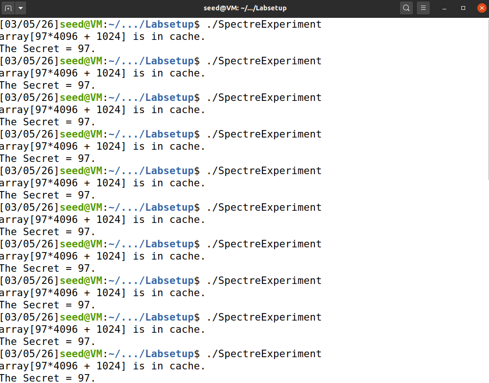
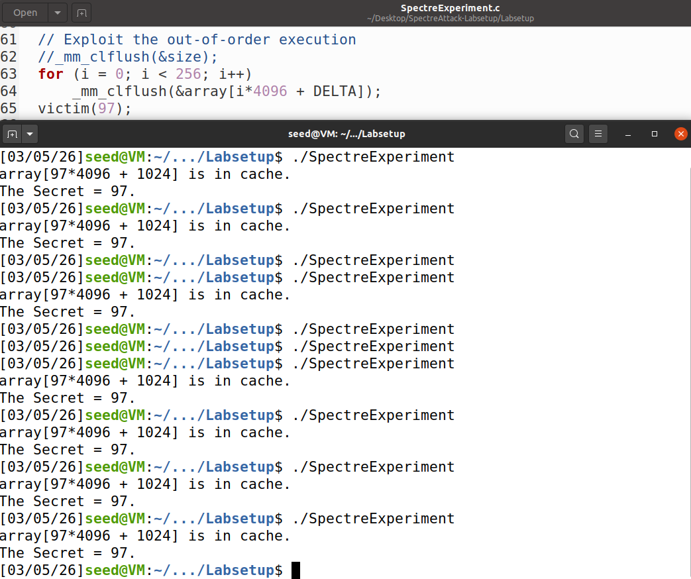
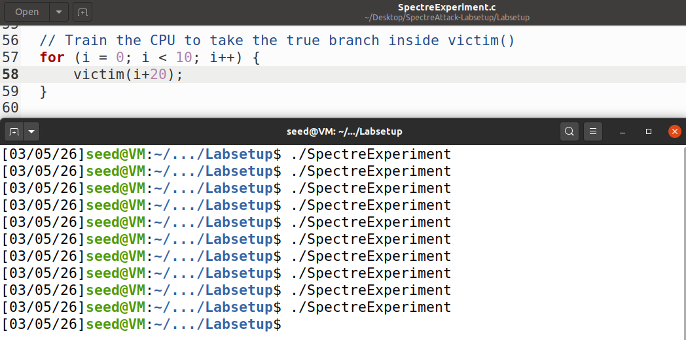
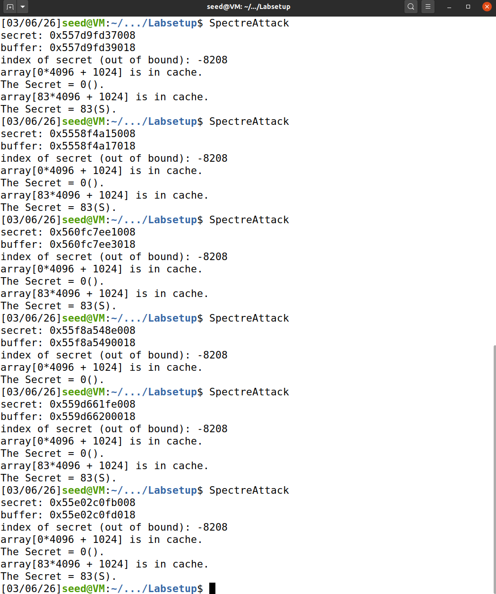
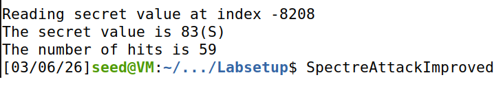
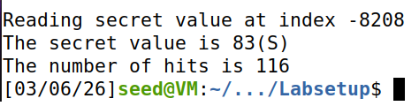
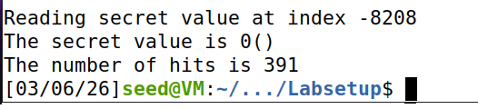
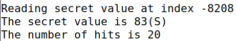
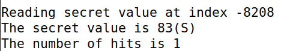
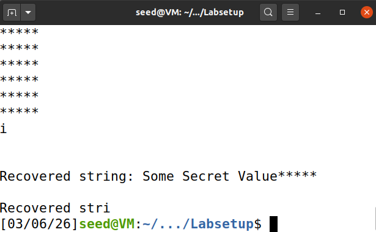

# Spectre Lab Writeup

This lab presents a layered and methodical approach to enacting attacks in the Spectre class.
These attacks exploit major vulnerabilities latent in the design of older CPUs relating to branch prediction,
and can also be classified as side-channel attacks.

## Tasks 1 and 2: Side Channel Attacks via CPU Caches

The first task aims to highlight the different speeds at which the CPU reads
data from cache and from the main memory. We are given a program *CacheTime.c*,
which can be easily compiled with 

```
gcc -march=native CacheTime.c -o cachetime
```

We can then automate execution of the program some *n* times and save the results to a file
*timings* for further analysis with the following bash script:

``` timingruns.sh

#!/bin/bash

program="./bin/cachetime"

if [ "$#" -ne 1 ]; then
	echo "Usage: $0 <nr-of-runs>"
	exit 1
fi

touch timings
for ((i=1;i<=$1;++i)); do
	echo "run $i" >> timings.txt
	./$program >> timings.txt
	sleep 0.5
done
```

After executing with the recommended number of 10 runs, we got this file:

```timings.txt

run 1
Access time for array[0*4096]: 344 CPU cycles
Access time for array[1*4096]: 532 CPU cycles
Access time for array[2*4096]: 400 CPU cycles
Access time for array[3*4096]: 200 CPU cycles
Access time for array[4*4096]: 424 CPU cycles
Access time for array[5*4096]: 400 CPU cycles
Access time for array[6*4096]: 388 CPU cycles
Access time for array[7*4096]: 212 CPU cycles
Access time for array[8*4096]: 392 CPU cycles
Access time for array[9*4096]: 404 CPU cycles
run 2
Access time for array[0*4096]: 408 CPU cycles
Access time for array[1*4096]: 428 CPU cycles
Access time for array[2*4096]: 440 CPU cycles
Access time for array[3*4096]: 132 CPU cycles
Access time for array[4*4096]: 424 CPU cycles
Access time for array[5*4096]: 472 CPU cycles
Access time for array[6*4096]: 924 CPU cycles
Access time for array[7*4096]: 136 CPU cycles
Access time for array[8*4096]: 448 CPU cycles
Access time for array[9*4096]: 416 CPU cycles
run 3
Access time for array[0*4096]: 376 CPU cycles
Access time for array[1*4096]: 964 CPU cycles
Access time for array[2*4096]: 496 CPU cycles
Access time for array[3*4096]: 224 CPU cycles
Access time for array[4*4096]: 500 CPU cycles
Access time for array[5*4096]: 492 CPU cycles
Access time for array[6*4096]: 500 CPU cycles
Access time for array[7*4096]: 132 CPU cycles
Access time for array[8*4096]: 512 CPU cycles
Access time for array[9*4096]: 524 CPU cycles
run 4
Access time for array[0*4096]: 372 CPU cycles
Access time for array[1*4096]: 508 CPU cycles
Access time for array[2*4096]: 480 CPU cycles
Access time for array[3*4096]: 140 CPU cycles
Access time for array[4*4096]: 508 CPU cycles
Access time for array[5*4096]: 476 CPU cycles
Access time for array[6*4096]: 500 CPU cycles
Access time for array[7*4096]: 120 CPU cycles
Access time for array[8*4096]: 492 CPU cycles
Access time for array[9*4096]: 500 CPU cycles
run 5
Access time for array[0*4096]: 640 CPU cycles
Access time for array[1*4096]: 464 CPU cycles
Access time for array[2*4096]: 488 CPU cycles
Access time for array[3*4096]: 220 CPU cycles
Access time for array[4*4096]: 880 CPU cycles
Access time for array[5*4096]: 492 CPU cycles
Access time for array[6*4096]: 452 CPU cycles
Access time for array[7*4096]: 224 CPU cycles
Access time for array[8*4096]: 508 CPU cycles
Access time for array[9*4096]: 492 CPU cycles
run 6
Access time for array[0*4096]: 464 CPU cycles
Access time for array[1*4096]: 488 CPU cycles
Access time for array[2*4096]: 884 CPU cycles
Access time for array[3*4096]: 280 CPU cycles
Access time for array[4*4096]: 464 CPU cycles
Access time for array[5*4096]: 484 CPU cycles
Access time for array[6*4096]: 460 CPU cycles
Access time for array[7*4096]: 208 CPU cycles
Access time for array[8*4096]: 472 CPU cycles
Access time for array[9*4096]: 484 CPU cycles
run 7
Access time for array[0*4096]: 412 CPU cycles
Access time for array[1*4096]: 624 CPU cycles
Access time for array[2*4096]: 480 CPU cycles
Access time for array[3*4096]: 212 CPU cycles
Access time for array[4*4096]: 496 CPU cycles
Access time for array[5*4096]: 500 CPU cycles
Access time for array[6*4096]: 476 CPU cycles
Access time for array[7*4096]: 224 CPU cycles
Access time for array[8*4096]: 624 CPU cycles
Access time for array[9*4096]: 484 CPU cycles
run 8
Access time for array[0*4096]: 350 CPU cycles
Access time for array[1*4096]: 470 CPU cycles
Access time for array[2*4096]: 422 CPU cycles
Access time for array[3*4096]: 196 CPU cycles
Access time for array[4*4096]: 456 CPU cycles
Access time for array[5*4096]: 458 CPU cycles
Access time for array[6*4096]: 456 CPU cycles
Access time for array[7*4096]: 192 CPU cycles
Access time for array[8*4096]: 458 CPU cycles
Access time for array[9*4096]: 442 CPU cycles
run 9
Access time for array[0*4096]: 576 CPU cycles
Access time for array[1*4096]: 472 CPU cycles
Access time for array[2*4096]: 624 CPU cycles
Access time for array[3*4096]: 128 CPU cycles
Access time for array[4*4096]: 424 CPU cycles
Access time for array[5*4096]: 500 CPU cycles
Access time for array[6*4096]: 440 CPU cycles
Access time for array[7*4096]: 132 CPU cycles
Access time for array[8*4096]: 436 CPU cycles
Access time for array[9*4096]: 452 CPU cycles
run 10
Access time for array[0*4096]: 306 CPU cycles
Access time for array[1*4096]: 390 CPU cycles
Access time for array[2*4096]: 404 CPU cycles
Access time for array[3*4096]: 118 CPU cycles
Access time for array[4*4096]: 400 CPU cycles
Access time for array[5*4096]: 400 CPU cycles
Access time for array[6*4096]: 404 CPU cycles
Access time for array[7*4096]: 124 CPU cycles
Access time for array[8*4096]: 414 CPU cycles
Access time for array[9*4096]: 900 CPU cycles
```

After analysing the results, we decided that 230 cycles would be a good margin
to consider everything below that to be cached already (for this particular machine).

For task 2, we are asked to perform a flush and reload technique in order to reveal a secret.
Essentially, this secret is an array index. By flushing the entire array from cache before
the victim accesses this index, we can then re-read the array and take note of the time to access each
index. If a certain index access time is under our pre-defined threshold, chances are it is the secret.

Luckily, a file *FlushReload.c* is already provided for this, and we simply substituted the threshold with our own
and ran the program 20 times with a similar script, taking note of the results.

```flushreloadruns.sh

#!/bin/bash

program="./bin/flushreload"

if [ "$#" -ne 1 ]; then
	echo "Usage: $0 <nr-of-runs>"
	exit 1
fi

touch flushreloads.txt
for ((i=1;i<=$1;++i)); do
	echo "run $i" >> flushreloads.txt
	./$program >> flushreloads.txt
	sleep 0.5
done
```
After running the script above, we inspected the results: 

```flushreloads.txt

run 1
array[94*4096 + 1024] is in cache.
The Secret = 94.
run 2
array[94*4096 + 1024] is in cache.
The Secret = 94.
run 3
array[94*4096 + 1024] is in cache.
The Secret = 94.
run 4
run 5
array[94*4096 + 1024] is in cache.
The Secret = 94.
run 6
array[94*4096 + 1024] is in cache.
The Secret = 94.
run 7
array[94*4096 + 1024] is in cache.
The Secret = 94.
run 8
array[94*4096 + 1024] is in cache.
The Secret = 94.
run 9
array[94*4096 + 1024] is in cache.
The Secret = 94.
run 10
array[94*4096 + 1024] is in cache.
The Secret = 94.
run 11
array[94*4096 + 1024] is in cache.
The Secret = 94.
run 12
array[94*4096 + 1024] is in cache.
The Secret = 94.
run 13
array[94*4096 + 1024] is in cache.
The Secret = 94.
run 14
array[94*4096 + 1024] is in cache.
The Secret = 94.
run 15
array[94*4096 + 1024] is in cache.
The Secret = 94.
run 16
array[94*4096 + 1024] is in cache.
The Secret = 94.
run 17
array[94*4096 + 1024] is in cache.
The Secret = 94.
run 18
array[94*4096 + 1024] is in cache.
The Secret = 94.
run 19
array[94*4096 + 1024] is in cache.
The Secret = 94.
run 20
array[94*4096 + 1024] is in cache.
The Secret = 94.
```

We can see that our threshold, albeit a bit conservative, got an excelent hit rate of 19/20 runs,
without predicting a wrong secret even once.

## Task 3: Out-of-Order Execution and Branch Prediction

In this task we analyze how modern CPUs perform **out-of-order (speculative) execution**, and how this behaviour can leave traces in the CPU cache. The provided program `SpectreExperiment.c` trains the CPU’s branch predictor and then intentionally provides an invalid input in order to trigger speculative execution.

### Normal Execution



When running the program normally, we occasionally observe that `array[97*4096 + DELTA]` appears as cached. This is unexpected because `97` is greater than `size` (10), meaning the condition `if (x < size)` should evaluate to false.

This occurs because the CPU was trained beforehand with valid inputs (`0–9`), causing the branch predictor to expect the condition to be true. When `victim(97)` is executed, the CPU speculatively executes the instruction inside the branch before the comparison completes. Although the execution is later reverted, the cache state remains changed and can be detected using the FLUSH+RELOAD technique.

### Commenting Out `_mm_clflush(&size)`



When the line `_mm_clflush(&size)` is commented out, the experiment becomes less reliable. In our tests, the expected result only appeared in **7 out of 10 executions**.

This happens because the value of `size` is no longer flushed from the cache. As a result, the CPU can read it much faster, reducing the window of time available for speculative execution. Because the condition is resolved more quickly, the speculative execution occurs less frequently.

### Replacing `victim(i)` with `victim(i + 20)`



When replacing `victim(i)` with `victim(i + 20)`, the attack stops working completely.

This happens because the training phase no longer causes the branch condition to evaluate to true. Since the CPU is not trained to expect the true branch, the branch predictor does not speculatively execute the code inside the `if` statement. As a result, the array element is not loaded into the cache and no side-channel signal is observed.

## Task 4: The Spectre Attack

In this task we run the full Spectre attack to leak a secret value located outside the allowed buffer. The program calculates the offset between the secret string and the buffer, and uses speculative execution to access the secret value indirectly.



In our experiments, the value **83**, corresponding to the character **'S'**, was frequently detected in the cache, revealing the first character of the secret string `"Some Secret Value"`.

However, the value **0** also appeared in some executions. This happens because the sandbox function returns `0` when the access is out of bounds, and sometimes the speculative execution does not leave a detectable cache trace.

Out of **10 executions**, the correct value **83 ('S')** was observed **7 times**, while **0** appeared **3 times**, demonstrating the presence of noise in the side-channel attack.

## Task 5: Improving the Attack Accuracy











In this task the attack is repeated many times and a **score** is kept for each possible value (0–255).  
Whenever a cache hit is detected for an index, its score is increased. After all iterations, the value with the highest score is considered the secret.

In most runs the program correctly identifies **83 ('S')**, which is the first character of the secret string `"Some Secret Value"`.

We executed the program **10 times**. The correct value **83** was obtained **9 times**, while **0** appeared **once**. The value `0` sometimes appears because it is often cached due to unrelated accesses, which introduces some noise in the side-channel measurements.

## Task 6: Stealing the Entire Secret String



In this task we modified the previous program so that the attack is repeated for multiple offsets beyond the buffer, allowing us to recover the entire secret string instead of just the first byte. For each position, the attack is executed many times and the value with the highest score is selected as the recovered character.

By repeating this process for consecutive positions, the program reconstructs the secret string. In our execution we were able to recover the string **"Some Secret Value"**, which matches the secret defined in the program.

During testing we also tried removing the line `printf("*****\n")` to see the characters appearing in real time as they were discovered. However, without this line the attack became unreliable and often failed to recover the correct characters. Restoring it made the attack work consistently again.